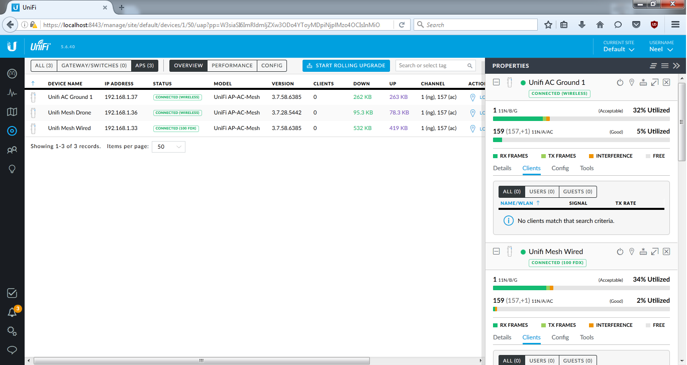
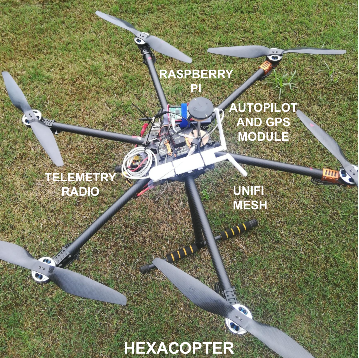

# Multi-Hop-Communication-System-using-UAVs
Establishing an efficient communication network is of paramount importance in natural disaster management. However, because of loss of cellular networks and other connectivity, relaying information from one place to another might not be possible. This paper proposes a prototype model to implement a UAV based Multi-hop communication system which would work seamlessly without the use of cellular network and the internet. A wireless Ad Hoc network is created, over which the transfer of files and messages takes place. The proposed model utilizes a mesh network to create a highly scalable and dynamic data routing model from source to destination. The prototype would have various practical applications, but our specific focus is to make a disaster relief solution. The system would act as a delay tolerant network gathering messages from one location and delivering them to another. The Network is Ad-Hoc without the need for continuous communication between the UAVs.

### User Interface:

# Instructions for installing ROS:
Install either ROS Kinetic / ROS Indigo, preferrably ROS Kinetic by following the instructions provided here: https://bit.ly/2Kp5JMR

# Steps to get the System Running:
1. Open terminal ( Alt+ Ctrl + T), and type in **rosversion -d**, to check if ROS has been correctly or not.
   If the version name is shown, it means that it has been correctly installed and is good to go.
2. Get to the directory where check **check_connection.py** is located, and type in **./check_connection.py**.
   For example, **cd Desktop/Summer\ Communications\ Project\ IP/comm_src/src/comm/src/** and then the above command.
   This would get the system going, and all the processes, as mentioned in the above Pipeline Process, will begin, and in order.
3. The files and folders that need to be in the same directory are: 
      1. check_connection.py
      2. nano2_comm.sh
      3. nanostation2.py
      4. send_folder
      5. receive_folder
4. Open check_connection.py and change the IP Address to the one you want to connect to, for example '192.168.1.202'.  
5. Open nano2_comm.sh
   1. Change the IP Adress to your own system's IP address in this line: export ROS_IP=192.168.1.200
   2. Change the IP Adress to the Master's (which is sending the files) IP address in this line: export ROS_MASTER_URI=http://192.168.1.202:11311
4. To kill all the processes, type in **killall -9 rosmaster**

   
   
# Pre Flight Setup   
  

# Lab/Experimental Setup
  

The preprint can be found here.
