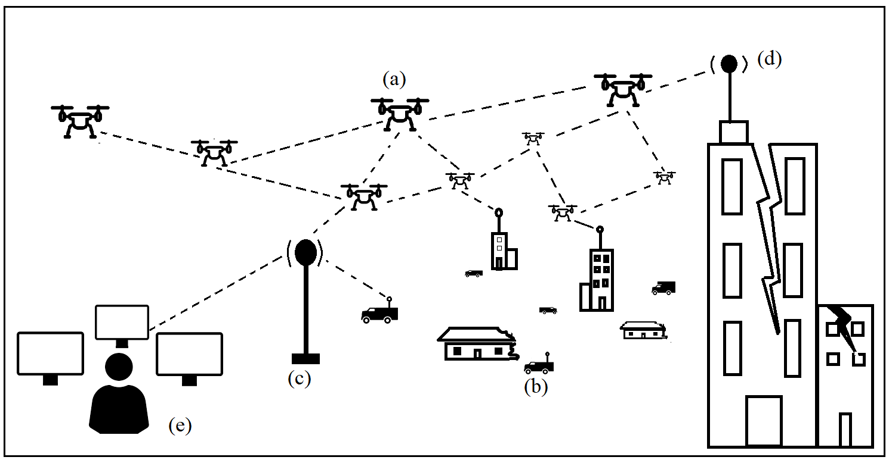
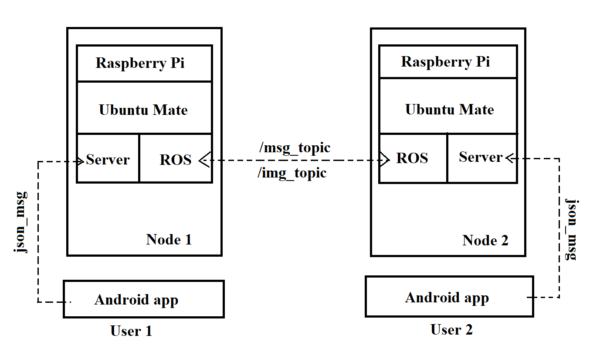
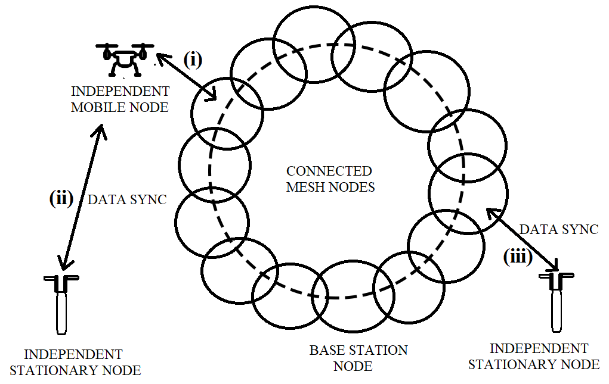

# ROSNet: A Wireless Mesh Network based Framework using UAVs and ground nodes for Post-Disaster Management

### Authors: Neelabhro Roy (KTH Royal Institute of Technology, Sweden), Sauranil Debarshi (IISc Bangalore, India) & Dr. PB Sujit (Associate Professor, IISER Bhopal, India)

### Abstract: 

Communication breakdowns during natural disasters can significantly restrict disaster management operations. Furthermore, cellular networks may also be unreliable in these scenarios. Hence, establishing communication using alternative means is of importance in these scenarios.
In this paper, we propose a prototype system to establish communication (using wireless mesh network - WMN) through the use of stationary and mobile ground nodes, and aerial nodes using unmanned aerial vehicles (UAVs). This network is ad hoc and establishes connectivity without the use of a cellular network or internet. Our system provides a complete end to end architecture, where we deploy an android application on smartphones at the user-end, the ad hoc network comprising of stationary and mobile nodes, and a graphical user interface (GUI) at the base station that shows situational awareness. We use the Robot Operating System (ROS) as the middleware for message synchronization and storage. We evaluate the system with three nodes for different system configurations by using UAV and a semi-autonomous car. Our experimental results show that the system could be indispensable in providing large scale connectivity.

### Use case description:

Wireless mesh network with stationary and mobile ground nodes and aerial nodes. (a) Aerial node. (b) Mobile Ground node. (c) Stationary node. (d) Stationary node in an earthquake affected infrastructure. (e) Base station / Central server.

### Software Architecture and Communication Interfaces of the model:

### Data synchronization:

#### Data synchronization between various nodes. (i) Independent Mobile node (ii) Independent Stationary node (iii) Independent Stationary node

# Instructions for installing ROS:
Install either ROS Kinetic / ROS Indigo, preferrably ROS Kinetic by following the instructions provided here: https://bit.ly/2Kp5JMR

# Steps to get the System Running:
1. Open terminal ( Alt+ Ctrl + T), and type in **rosversion -d**, to check if ROS has been correctly or not.
   If the version name is shown, it means that it has been correctly installed and is good to go.
2. Get to the directory where check **check_connection.py** is located, and type in **./check_connection.py**.
   For example, **cd Desktop/Summer\ Communications\ Project\ IP/comm_src/src/comm/src/** and then the above command.
   This would get the system going, and all the processes, as mentioned in the above Pipeline Process, will begin, and in order.
3. The files and folders that need to be in the same directory are: 
      1. check_connection.py
      2. nano2_comm.sh
      3. nanostation2.py
      4. send_folder
      5. receive_folder
4. Open check_connection.py and change the IP Address to the one you want to connect to, for example '192.168.1.202'.  
5. Open nano2_comm.sh
   1. Change the IP Adress to your own system's IP address in this line: export ROS_IP=192.168.1.200
   2. Change the IP Adress to the Master's (which is sending the files) IP address in this line: export ROS_MASTER_URI=http://192.168.1.202:11311
4. To kill all the processes, type in **killall -9 rosmaster**
   
# Pre Flight Setup   
  

# Lab/Experimental Setup
  

The preprint can be found here.
https://www.techrxiv.org/articles/Multi_hop_Communication_cls_for_IEEE_Journals_pdf/10303394

### Reference:
[1] Roy, Neelabhro; Debarshi, Sauranil; Sujit, P.B. (2019): ROSNet: A WMN based Framework using UAVs and ground nodes for Post-Disaster Management. TechRxiv. Preprint. https://doi.org/10.36227/techrxiv.10303394.v3
Accepted for Publication at the IEEE Humanitarian Technology Conference 2021 (IEEE HTC 2021)

#### A link to the video demonstration using static ground nodes can be found here: https://youtu.be/MA1lv_i9EE8
#### A link to the video demonstration using aerial nodes can be found here: https://youtu.be/6mjy-1pgTQU

